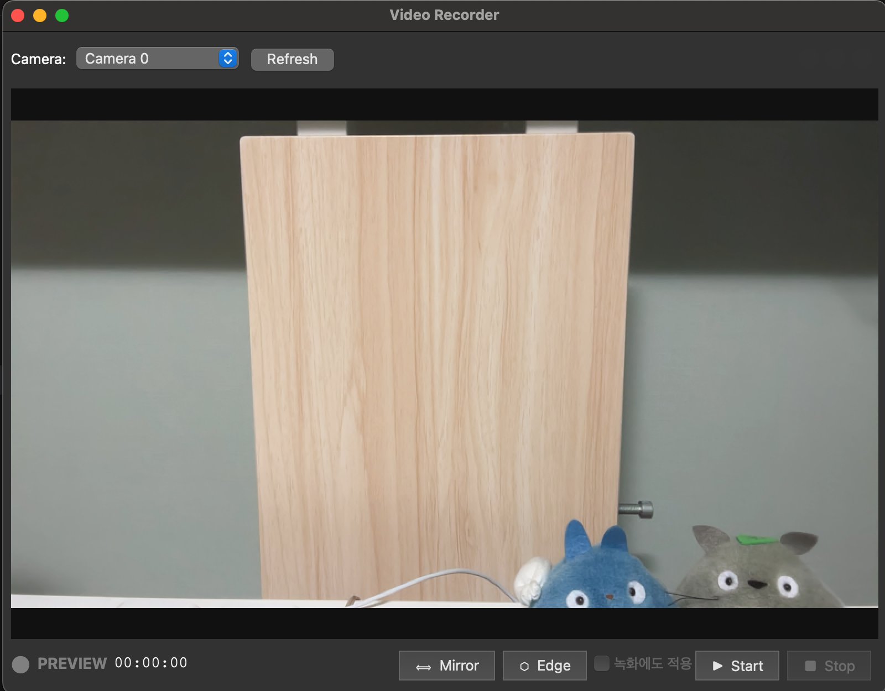
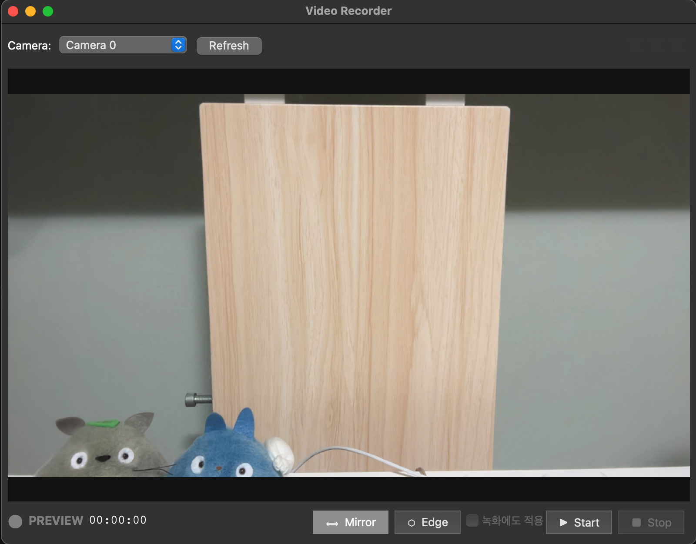
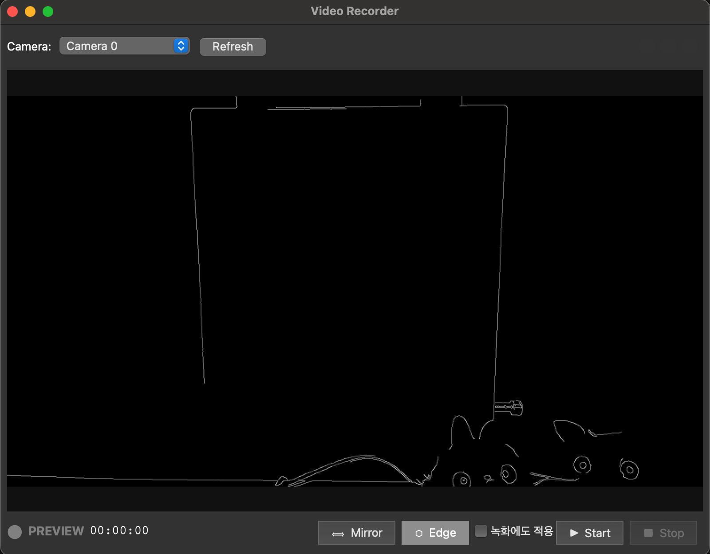

# EdgeFind Recorder

Python + OpenCV + PyQt5 기반의 웹캠 비디오 녹화 프로그램.
컴퓨터 비전 학습을 위한 기반 프로젝트로, 실시간 영상 처리 파이프라인을 직접 구현합니다.

## 기능

### 녹화
- 웹캠 실시간 미리보기 및 녹화 (MP4)
- 3초 카운트다운 후 녹화 시작 
- 녹화 중 경과 시간 표시
- 녹화 중 빨간 점 + REC 오버레이
- Space 키로 녹화 시작/정지, ESC 키로 종료

### 카메라
- 연결된 카메라 자동 감지 및 드롭다운 선택
- 카메라 전환 지원
- 카메라 권한 안내 다이얼로그

### 영상 처리 (추가기능)
- **Mirror (좌우 반전)**
  | Origin | Mirror |
  |:---:|:---:|
  |  |  |
- **Edge (Canny 엣지 검출)** — 실시간 윤곽선 탐지
  | Origin | Edge |
  |:---:|:---:|
  |  |  |
- CLAHE + LAB 3채널 + Median 자동 threshold 조합
- 환경 밝기에 따라 감도 자동 조절
- preview 전용 또는 녹화에도 적용 선택 가능
- 녹화 중에는 Mirror/Edge 설정 변경 불가 (상태 보호)

## 단축키

| 키 | 동작 |
|---|---|
| `Space` | 녹화 시작 / 정지 |
| `ESC` | 프로그램 종료 |

## 디렉토리 구조

```
video_recorder/
├── src/
│   ├── main.py            # 진입점 (QApplication 실행)
│   ├── main_window.py     # PyQt5 메인 윈도우 + UI 로직
│   ├── camera_thread.py   # QThread 카메라 캡처 스레드
│   └── filters.py         # 영상 처리 필터 (Canny 등)
├── output/                # 녹화 파일 저장 (자동 생성)
├── pyproject.toml
└── README.md
```

## 실행

```bash
# 가상환경 활성화
source .venv/bin/activate

# 실행
python src/main.py
```
